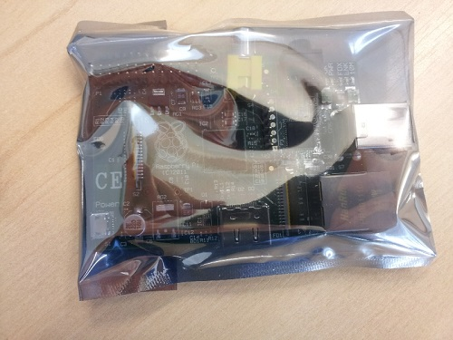
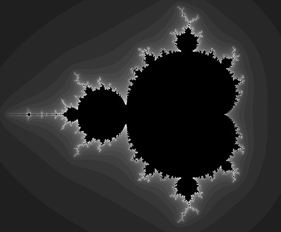
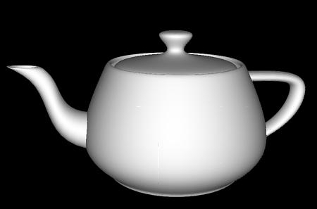

Raspberry Pi demo programs 
=============
How to run the hello_pi demo programs on Raspbian



##So you’ve got a Raspberry Pi, now what?
How about running some demo programs that showcase what the Pi is capable of?  Awesome graphics anyone?
Raspbian comes with a range of demo programs which you can just compile and run.  They range from simple hello world text output to full 1080p HD video playback, 3D spinning teapots and real time animating fractal patterns.
These are a great way to get a feel for what the Pi can do and to gain some familiarity with navigating around the system and running programs at the command line.

##Time
* 10 minutes

## Step 1: Setting Up your Pi
First check that you have all the parts you need to get your Raspberry Pi set up and working.

- Raspberry Pi
- Micro USB power adapter
- An SD Card with Raspbian already set up through NOOBS
- USB Keyboard
- HDMI cable
- A Monitor or TV

**Activity Checklist**

1.	Place the SD card into the slot of your Raspberry Pi. It will only fit one way so be careful not to break the card. 
2.	Next connect the HDMI cable from the monitor (or TV) to the HDMI port on the Pi and turn on your monitor. 
3.	Plug a USB keyboard into a USB slot on the Pi.
4.	Plug in the micro USB power supply and you should see some text appear on your screen.
5.	When prompted to login type:

	```
	Login: pi
	Password: raspberry
	```

##Step 2: Oh no! A command line interface!

You will find yourself at the prompt below.  If you have configured your Pi to automatically go into the desktop interface, use the start button to logout of the desktop.

`pi@raspberrypi ~ $ _`

This (above) is the command prompt, try not to be afraid of it.  A CLI (command line interface) is actually a very quick and efficient way to use a computer.

Firstly navigate to the `hello_pi` folder where all the demos are stored.  Enter the command below to do this.  **TIP**: You can use the TAB key for auto-complete as you enter commands.

`cd /opt/vc/src/hello_pi`

The command prompt should now look like this, the blue part shows where you are in the file system of the Pi.

`pi@raspberrypi /opt/vc/src/hello_pi $ _`

If you enter ls and press enter you’ll see a list of folders.  One for each demo.  Before you can run them though they must be compiled.  Don’t worry if you don’t understand why you need to do this, just take it on faith for now.

There is a small shell script supplied in the hello_pi folder called rebuild.sh which will do the compile for you, enter the following command to run it.  Ignore the Gobbledygook for now!

`./rebuild.sh`

A lot of text will scroll up the screen now, you can ignore it.  It is just the output of the compiler as it works through the demo code.  Wait for the command prompt to return before you continue.

Now we’re ready to run some demos.

##Step 3: Hello video

This will play a 15 second long full HD 1080p video clip with no sound, the intention here is to demonstrate video decode and playback capability.  You’ll see its very smooth!


 
Enter the following commands to go inside the `hello_video` folder and list the files.

```
cd hello_video
ls
```

You’ll notice the `.bin` file is shown in green, this is because it is an executable file.  Meaning this is the file we run to launch the program.  This demo needs to be told what video clip to play when we run it though, so this must be the `test.h264` file (h264 is a type of video codec).

Use the following command to run the demo. You need the `./` to specify the current directory.  Otherwise the Linux system folders are searched for the filename you type.

`./hello_video.bin test.h264`

##Step 4: Hello triangle

This displays a spinning cube with different images on each side.  This is intended to demonstrate Open GL ES rendering (an open source programming library for doing 3D graphics).

Enter the following commands to go navigate to the `hello_triangle` folder and list its contents.

```
cd ..
cd hello_triangle
ls
```

You’ll again see one of the files is green, this is the executable file.  This demo doesn’t need any video input files like the previous one so you can just go ahead and run the `.bin` file.

`./hello_triangle.bin`

The demo will run forever until you decide to quit.  To exit the demo press `Ctrl – C`.

##Step 5: Hello triangle 2

This one displays two superimposed fractals, one on top of the other.  You can move the mouse to change the shape of the fractal in real time.  This is also intended to demonstrate Open GL ES rendering.  Some of you may recognise the Mandelbrot fractal.



```
cd ..
cd hello_triangle2
ls
```

Notice the green `.bin` file?  Okay run it.

`./hello_triangle2.bin`

Now move the mouse around and you’ll see the fractal changing.  See if you can get it to form a perfect circle.  It’s a little tricky but it can be done.  To exit the demo press `Ctrl – C`.

##Step 6: Hello teapot
This displays a spinning teapot with the video clip from `hello_video` texture-mapped onto its surface.  Impressive.  You may recognise the teapot model if you’re familiar with a piece of software called Blender.  This demonstrates Open GL ES rendering and video decode/playback at the same time.



```
cd ..
cd hello_teapot
ls
```

Notice the green `.bin` file?  Okay run it.  Getting the hang of this now?

`./hello_teapot.bin`

You may receive the following error when you try to run this demo.  Don’t worry though, you just need to alter one configuration setting to make it work.  See below.

```
Note: ensure you have sufficient gpu_mem configured
eglCreateImageKHR:  failed to create image for buffer 0x1 target 12465 error 0x300c
eglCreateImageKHR failed.
```

The error means the GPU (graphics processing unit) does not have enough memory to run the demo.  It’s the GPU that does all the heavy lifting when drawing 3D graphics to the screen (a bit like a graphics card found in a gaming PC).  The Raspberry Pi shares its memory/RAM between the CPU and GPU and by default is configured to only give 64 MB of RAM to the GPU.  If we increase this to 128 that should do it.

Here is how to do that.  Enter the following command.

`sudo raspi-config`

This will open up a menu on a blue background.  Perform the following actions.
* Go to Advanced Options
* Go to Memory Split
* Delete back 64 and enter 128, press enter
* Go down to Finish
* Say Yes to reboot

After you have logged back in enter the following command to get back to the `hello_teapot` demo.

`cd /opt/vc/src/hello_pi/hello_teapot`

Now try and run it again and you should find it will work.

`./hello_teapot.bin`

The demo will run forever until you quit. To exit the demo press `Ctrl – C`. 

##Step 7: Hello audio
This demo just demonstrates audio output.  It plays a sine wave which makes a kind of WOO WOO WOO sound.

```
cd ..
cd hello_audio
ls
```

Notice the green `.bin` file?  Okay run it.  Getting the hang of this now?

`./hello_audio.bin`

This will play the sound over the headphone jack on the Pi, if you’re using a HDMI monitor you can make it output over HMDI by adding a `1` to the command.

`./hello_audio.bin 1`

The demo will run forever until you quit. To exit the demo press `Ctrl – C`.

##Step 8: Other demos

I think by now you should be getting the hang of navigating up into the parent `hello_pi` folder (using `cd ..`) and then down into one of the demo folders (using cd `hello_something`).  Try some of the other demos on your own.  The `hello_videocube` one is quite good.

Good luck!
